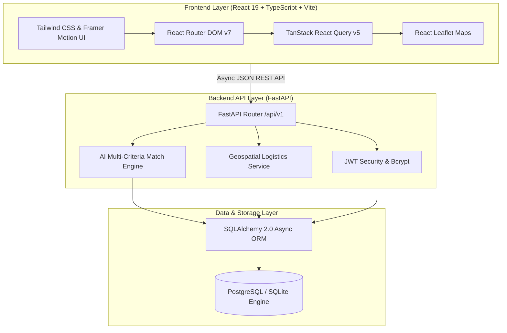
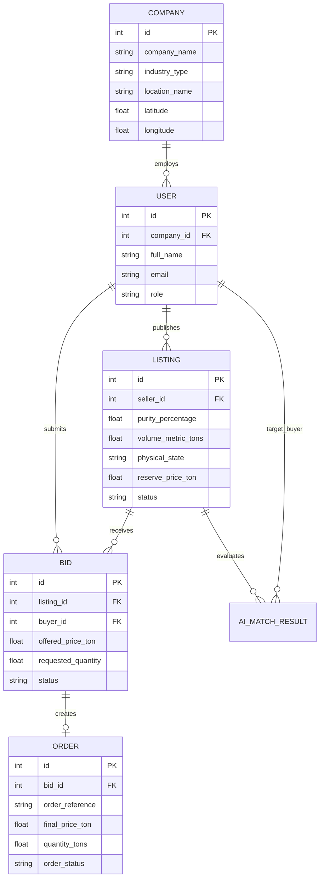

<div align="center">

# 🌍 CarbonX

### AI-Powered Carbon Capture-to-Product Matchmaking Platform

**Turning Captured CO₂ Into High-Value Products**

> **Capture CO₂ → Profile It → Match It → Convert It → Create Value**

CarbonX is an AI-powered carbon utilization and matchmaking platform that analyzes captured CO₂ stream specifications, discovers compatible industrial utilization pathways, estimates environmental and economic potential, and connects carbon emitters directly with off-takers and product opportunities.

---

[](https://fastapi.tiangolo.com/)
[](https://react.dev/)
[](https://www.typescriptlang.org/)
[](https://www.python.org/)
[](https://www.postgresql.org/)
[](https://tailwindcss.com/)
[](LICENSE)

</div>

---

## 💡 Executive Summary

Industrial carbon capture technology is accelerating rapidly, but captured CO₂ still faces a critical bottleneck: **finding a viable commercial destination.** 

Emitted and captured CO₂ streams vary drastically by purity, temperature, pressure, volume, and chemical contaminants. Simultaneously, off-takers in synthetic fuels, building materials, mineralization, and specialty chemicals require strict feedstocks. **CarbonX bridges this gap.** By combining deterministic multi-criteria scoring, geospatial logistics optimization, and real-time commercial marketplace mechanics, CarbonX transforms industrial waste gas into profitable commercial supply chains.

---

## 🌎 The Problem

```text
  Industrial Emissions
          ↓
     CO₂ Capture
          ↓
  Captured CO₂ Stream
          ↓
        ❓ 
"What can we actually do with it?"
```

1. **Captured CO₂ Has No Standard Destination**: Capturing carbon is only the first step. Without off-takers, captured gas must be sequestered or vented.
2. **Extreme Technical Heterogeneity**: A 98.5% pure liquid stream from a cement facility requires completely different handling than a 94.8% pressurized gas stream from a steel mill.
3. **Fragmented Marketplace**: Carbon producers and potential industrial buyers currently rely on manual, slow, high-friction brokerage.
4. **Complex Economic & Freight Trade-offs**: Landed cost varies heavily based on transport distance, physical state, and regional freight tariffs.

---

## ⚡ The CarbonX Solution

```text
CO₂ Source (Emitter) 
        ↓
CO₂ Stream Fingerprinting (Purity, Pressure, Volume, Impurities)
        ↓
AI Compatibility & Matching Engine
        ↓
Logistics & Landed Cost Calculation
        ↓
Multi-Criteria Ranking & XAI Rationale
        ↓
Commercial Marketplace Bidding & Order Fulfillment
```

CarbonX automates the entire journey from captured molecule to industrial off-take contract through an end-to-end digital intelligence platform:

* **CO₂ Stream Fingerprinting**: Structured profiling of chemical purity, physical state, pressure, volume availability, and location coordinates.
* **Deterministic Multi-Criteria Match Engine**: Evaluates technical fit, freight distance, price ceiling, and supplier reliability without black-box unpredictability.
* **Geospatial & Freight Economics**: Haversine transport distance matrix calculation and landed price estimation.
* **Bidding & Order Execution**: Real-time commercial bid negotiations, acceptance workflows, and trackable delivery orders.

---

## ⚖️ Why CarbonX?

| Traditional Approach | CarbonX Platform |
| :--- | :--- |
| **Manual Research & Cold Outreach** | **Instant AI-Assisted Compatibility Matching** |
| **Fragmented CO₂ Data Sheets** | **Standardized CO₂ Stream Fingerprints** |
| **Unpredictable Freight Costs** | **Automated Landed Cost & Logistics Engine** |
| **Generic Recommendations** | **Source-Specific Technical & Economic Scoring** |
| **Opaque Pricing** | **Transparent Marketplace Bidding & Contract Execution** |

---

## 🧠 Multi-Criteria AI Matchmaking Engine

The heart of CarbonX is a **Deterministic, Multi-Criteria Recommendation Engine** (`AIMatchEngineService`) that scores candidate CO₂ streams against buyer constraints with 100% explainability.

```text
                 CO₂ Source Stream Candidate
                              │
  ┌───────────────────────────┴───────────────────────────┐
  │                 Hard Constraints Filter               │
  │  • Purity >= Minimum Floor                            │
  │  • Available Volume >= 25% Required                   │
  │  • Logistics Distance <= 500 km                       │
  └───────────────────────────┬───────────────────────────┘
                              │
                    Normalized Scoring
                              │
┌─────────────────────────────┼─────────────────────────────┐
│ Dimension                   │ Weight                      │
├─────────────────────────────┼─────────────────────────────┤
│ 🧪 Chemical Purity Fit     │ 30 %                        │
│ 🚚 Transport Distance       │ 25 %                        │
│ 💰 Landed Price vs Budget   │ 20 %                        │
│ 📦 Volume Capability        │ 10 %                        │
│ ⏱️ Delivery Lead Time       │ 10 %                        │
│ 🛡️ Supplier Reliability     │  5 %                        │
└─────────────────────────────┴─────────────────────────────┘
                              │
                              ▼
        Weighted Match Score (0–100) + XAI Rationale
```

### 🔬 Scoring Formula & Logic

1. **Hard Filtering Gates**:
   - `Purity < Minimum Purity Floor` $\rightarrow$ Disqualified
   - `Available Volume < 25% of Required Volume` $\rightarrow$ Disqualified
   - `Logistics Distance > 500 km` $\rightarrow$ Disqualified

2. **Composite Weighted Score**:
$$\text{Score} = (S_{\text{purity}} \times 30) + (S_{\text{distance}} \times 25) + (S_{\text{price}} \times 20) + (S_{\text{quantity}} \times 10) + (S_{\text{delivery}} \times 10) + (S_{\text{reliability}} \times 5)$$

3. **Explainable AI (XAI) Output**:
   Every match result includes algorithmic confidence percentages, compatibility tier (`HIGH_MATCH`, `MODERATE_MATCH`, `LOW_MATCH`), a 6-dimension breakdown, and a natural language explanation detailing exact cost savings per ton and purity margins.

---

## 🚀 Key Implemented Features

| Module | Features & Capability |
| :--- | :--- |
| **🏭 Seller Suite** | Create & manage CO₂ stream listings, set reserve prices, define physical states (liquid, pressurized gas, supercritical), and track incoming buyer bids. |
| **🛒 Buyer Marketplace** | Interactive listing catalog with filtering by purity floor, physical state, price ceiling, volume, and Leaflet geospatial map integration. |
| **🧠 AI Match Engine** | Multi-attribute candidate evaluation, ranking, confidence scoring, and natural language match rationale generation. |
| **💼 Commercial Bids & Orders** | Full lifecycle bidding (submit, accept, reject), order reference generation (`#CX-ORD-XXXX`), and delivery tracking. |
| **🚚 Logistics Calculator** | Automated Haversine distance calculations, transport freight estimates ($/ton), and road transport footprint metrics. |
| **🤖 CarbonX AI Copilot** | Conversational assistant providing guidance on CO₂ utilization, purity requirements, and market pricing insights. |

---

## 🎨 Product Showcase

> 📸 **Screenshots coming soon.**
> *(Interface features a sleek dark climate-tech design built with React 19, Tailwind CSS, Lucide Icons, and Framer Motion.)*

---

## 🏗️ System Architecture



---

## 🧬 Data Model



---

## 🛠️ Tech Stack

| Component | Technology | Purpose |
| :--- | :--- | :--- |
| **Frontend Framework** | React 19 + TypeScript 5.7 | High-performance user interface |
| **Build Tool & Bundler** | Vite 6 | Next-gen dev server & bundle optimization |
| **Styling & Icons** | Tailwind CSS 3.4 + Lucide React | CarbonX climate-tech design system |
| **State & API** | TanStack React Query v5 + Axios | Data fetching, caching, and server state |
| **Mapping** | Leaflet + React Leaflet | Geospatial cluster visualization |
| **Backend Framework** | FastAPI 0.110 | Asynchronous Python REST API |
| **Database ORM** | SQLAlchemy 2.0 (Async) | Async database interaction |
| **Database** | SQLite (Default Dev) / PostgreSQL (Prod) | Relational data store |
| **Authentication** | Python-JOSE (JWT) + Passlib (Bcrypt) | Secure role-based authorization |

---

## 📂 Project Structure

```text
Carbon-Capture-to-Product-Matchmaking-Platform/
├── backend/
│   ├── app/
│   │   ├── api/             # FastAPI Endpoint Routers (auth, seller, marketplace, ai, bids, orders)
│   │   ├── models/          # SQLAlchemy Async Database Models
│   │   ├── schemas/         # Pydantic Schemas for Input Validation
│   │   ├── services/        # AI Match Engine, Auth, & Logistics Logic
│   │   ├── config.py        # Environment Settings & CORS Configuration
│   │   ├── database.py      # Async Engine & Session Management
│   │   ├── main.py          # FastAPI Application Entry & Error Handlers
│   │   └── security.py      # Password Hashing & JWT Utilities
│   ├── scripts/             # DB Initialization Scripts
│   ├── .env.example         # Backend Environment Variable Template
│   ├── requirements.txt     # Python Dependencies
│   └── seed.py              # Idempotent Database Seeder
├── frontend/
│   ├── src/
│   │   ├── components/      # UI Components (Navbar, Cards, Modals, Forms)
│   │   ├── pages/           # Buyer, Seller, Public & Shared Dashboards
│   │   ├── services/        # Frontend API Axios Clients
│   │   ├── types/           # TypeScript Data Definitions
│   │   ├── App.tsx          # Main React Component & Layout
│   │   └── main.tsx         # Application Entry Point
│   ├── package.json         # NPM Dependencies & Scripts
│   ├── tailwind.config.ts   # Design Tokens & Styling Theme
│   └── vite.config.ts       # Vite Configuration
├── carbonx.db               # SQLite Local Database File
├── run.bat                  # One-Click Windows Automated Launcher
└── stop.bat                 # One-Click Background Server Teardown
```

---

## ⚡ Quick Start & Installation

### Prerequisites

* **Python**: `3.10` or higher
* **Node.js**: `18.0` or higher
* **Package Manager**: `npm` v9+

---

### Option A: One-Click Automated Launch (Windows)

Simply run the launcher script from the root directory:

```cmd
run.bat
```

*`run.bat` automatically creates the Python virtual environment, installs backend and frontend dependencies, initializes the database schema, seeds demo data, starts both servers, and opens `http://localhost:5173` in your browser.*

To stop all servers:
```cmd
stop.bat
```

---

### Option B: Manual Setup

#### 1. Clone the Repository
```bash
git clone https://github.com/DhruvGhevariya/Carbon-Capture-to-Product-Matchmaking-Platform.git
cd Carbon-Capture-to-Product-Matchmaking-Platform
```

#### 2. Setup Backend Environment
```bash
cd backend
python -m venv .venv

# On Windows:
.venv\Scripts\activate
# On Linux/macOS:
source .venv/bin/activate

pip install -r requirements.txt
cp .env.example .env
```

#### 3. Initialize & Seed Database
```bash
python seed.py
```

#### 4. Run Backend Server
```bash
uvicorn app.main:app --reload --port 8000
```
*Backend API Docs will be available at `http://127.0.0.1:8000/docs`.*

#### 5. Setup & Run Frontend (In a separate terminal)
```bash
cd frontend
npm install
npm run dev
```
*Frontend UI will be running at `http://localhost:5173`.*

---

## 🔑 Pre-Configured Seed Accounts

For evaluation and testing, the database is seeded with realistic industrial accounts (`password123` for all):

| Role | Email | Company Name | Industry | Location |
| :--- | :--- | :--- | :--- | :--- |
| **Seller** | `rajesh.verma@ultratech.com` | UltraTech Cement | Cement | Sanand Cluster, Ahmedabad |
| **Seller** | `suresh.s@ambujacement.com` | Ambuja Cement | Cement | Hazira Zone, Surat |
| **Seller** | `p.patnaik@tatasteel.com` | Tata Steel | Steel | Jamnagar Corridor |
| **Buyer** | `ananya.s@greengrow.in` | GreenGrow Chemicals | Agro-Chemicals | Kheda Agri Park, Vadodara |
| **Buyer** | `vikram.m@ecobuild.in` | EcoBuild Materials | Building Materials | Naroda Estate, Ahmedabad |
| **Buyer** | `rohan.d@carbonfuel.tech` | CarbonFuel Labs | Synthetic Fuels | Surat Clean Tech Cluster |

---

## 🔌 API Overview

Detailed interactive OpenAPI documentation is auto-generated at `http://127.0.0.1:8000/docs`.

### Core API Endpoints

| Method | Endpoint | Description |
| :--- | :--- | :--- |
| `GET` | `/health` | Server health check |
| `POST` | `/api/v1/auth/login` | User authentication & JWT generation |
| `GET` | `/api/v1/auth/me` | Current user profile |
| `GET` | `/api/v1/marketplace/listings` | Search & filter active CO₂ listings |
| `POST` | `/api/v1/seller/listings` | Create a new CO₂ stream listing |
| `POST` | `/api/v1/ai/recommendations` | Execute AI multi-criteria matchmaking |
| `POST` | `/api/v1/bids` | Submit a commercial purchase bid |
| `POST` | `/api/v1/bids/{id}/accept` | Accept a commercial bid |
| `GET` | `/api/v1/orders` | View confirmed carbon delivery orders |
| `POST` | `/api/v1/logistics/estimate` | Calculate transport distance & freight cost |

---

## 🗺️ Product Roadmap

### ✅ Completed & Fully Implemented
- [x] CO₂ stream fingerprinting (purity, volume, state, pressure, location).
- [x] Deterministic 6-dimension multi-criteria AI matchmaking engine.
- [x] Explainable AI (XAI) confidence scoring and rationale generation.
- [x] Commercial bidding & order execution workflow.
- [x] Geospatial Leaflet map visualization for listings and suppliers.
- [x] Automated one-click Windows setup (`run.bat`).

### 🚧 In Progress
- [ ] Real-time transport route polyline overlays on Leaflet map.
- [ ] CO₂ purity sensor data stream simulator via WebSockets.

### 🔮 Future Roadmap
- [ ] **LLM RAG Copilot**: Vector search (pgvector) over industrial CO₂ utilization literature.
- [ ] **MRV & Smart Contracts**: Automated Measurement, Reporting & Verification for carbon credit issuance.
- [ ] **Industrial Cluster Optimization**: Pipeline vs road tanker cost-curve analysis.
- [ ] **Life Cycle Assessment (LCA)**: Real-time net carbon offset calculations.

---

## 🔒 Trust & Technical Disclaimers

> **Notice**: Match scores and financial estimations provided by CarbonX are model-based decision aids calculated from user-provided inputs and standard logistics parameters. Commercial off-take agreements, gas sampling, and purity verification should be audited by certified third-party testing laboratories before physical delivery.

---

## 🤝 Contributing

Contributions are welcome! Follow these steps:

1. **Fork** the repository.
2. **Create** a feature branch (`git checkout -b feature/AmazingFeature`).
3. **Commit** your changes (`git commit -m 'Add AmazingFeature'`).
4. **Push** to the branch (`git push origin feature/AmazingFeature`).
5. **Open** a Pull Request.

---

## 📄 License

This project is licensed under the **MIT License**. See the `LICENSE` file for details.

---

<p align="center">

### 🌍 CarbonX

**Turning captured carbon into productive value.**

*Built for a cleaner, circular industrial future.*

</p>
